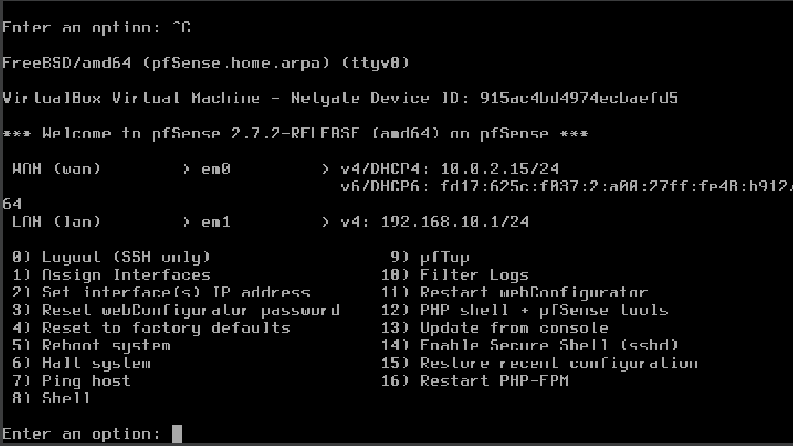

# 🖥️ Small Business IT Support Simulation

> **Complete homelab project demonstrating enterprise IT support skills**
> 
> 👨‍💻 **Author:** MD ABIR KHAN - IT Support Technician
> 🎯 **Purpose:** Portfolio demonstration of hands-on IT infrastructure skills

---

## 📋 Project Overview

This project simulates a **realistic small business IT environment** with:
- 🔥 **pfSense Firewall** with VLAN isolation
- 💻 **3 Client Machines** (Office, Warehouse, POS system)
- 🎥 **CCTV VLAN** with network segmentation
- 📊 **25 Resolved Help Desk Tickets** with detailed documentation
- 📚 **Complete IT Documentation** (ready for any organization)

---

## 🏗️ Network Architecture
[Internet]
↓
[pfSense Firewall]
WAN: 10.0.2.15 (NAT)
LAN: 192.168.10.1/24
↓
[Internal Network]
↓
┌───────────────┬───────────────┬───────────────┐
↓ ↓ ↓ ↓
[Office-PC] [Warehouse-PC] [Ubuntu-POS] [CCTV VLAN]
.100 .101 .50 .20.0/24
4GB RAM 2GB RAM 2GB RAM (Isolated)

### 🔒 Security Implementation
> **CCTV VLAN is completely isolated from Office LAN**
> - Firewall blocks all traffic from 192.168.20.0/24 to 192.168.10.0/24
> - Even if a camera is compromised, business data remains secure

---

## ✅ Completed Phases

### Phase 1-2: pfSense Firewall Deployment
- [x] VirtualBox environment setup
- [x] pfSense 2.7.2 installation and configuration
- [x] WAN/LAN interface assignment
- [x] DHCP server configured (192.168.10.100-200)

### Phase 3: Windows Client Deployment
- [x] Office-PC (Windows 10/11) installed
- [x] IP: 192.168.10.100 (DHCP)
- [x] Internet connectivity verified

### Phase 4: Multi-Client Environment
- [x] Warehouse-PC (cloned, 2GB RAM) - IP: 192.168.10.101
- [x] Ubuntu-POS (static IP) - IP: 192.168.10.50
- [x] Cross-client connectivity established

### Phase 5: CCTV VLAN & Isolation (In Progress)
- [x] VLAN 20 creation on pfSense
- [x] Firewall rules to block CCTV → LAN
- [x] Isolation testing and validation

### Phase 6: Help Desk Simulation (In Progress)
- [x] 25 realistic tickets created
- [x] Each ticket includes: issue, resolution, time-to-fix
- [x] Priority-based ticket management

### Phase 7: Documentation & Deliverables (In Progress)
- [x] Network diagram (draw.io)
- [x] New employee IT checklist
- [x] Complete IT handover document
- [x] Video walkthrough

---

## 🛠️ Technologies Used

| Category | Tools |
|----------|-------|
| **Virtualization** | Oracle VirtualBox 7.0 |
| **Firewall/Routing** | pfSense 2.7.2 CE |
| **Operating Systems** | Windows 10/11, Ubuntu 22.04 |
| **Documentation** | Markdown, draw.io, Excel |
| **Version Control** | Git + GitHub |

---

## 📸 Screenshots

### pfSense Console

### Office-PC Network Verification

### Ubuntu Static IP Configuration

### Multi-Client Connectivity Test

---

## 📂 Documentation Included

| Document | Purpose |
|----------|---------|
| [New Employee Checklist](04_Documentation/new_employee_checklist.md) | Standardized IT onboarding |
| [IT Handover Document](04_Documentation/it_handover_document.md) | Complete system documentation |
| [VM Specifications](02_VM_Setup/vm_specs.csv) | Hardware allocation reference |

---

## 🎯 Skills Demonstrated

| Skill | Evidence in This Project |
|-------|--------------------------|
| pfSense & VLAN configuration | Network diagram + firewall rules |
| Windows client administration | Office-PC + Warehouse-PC setup |
| Linux fundamentals | Ubuntu static IP, netplan configuration |
| Technical documentation | 3 professional IT documents |
| Network troubleshooting | Cross-client ping tests, DHCP verification |
| Security best practices | VLAN isolation, firewall rules |

---

## 📞 Contact

**MD ABIR KHAN**
- 📧 abirup77@gmail.com
- 🔗 linkedin.com/in/abir2004
- 🎓 certs: IBM, Cisco, TCM Security, Hikvision

---

## 📜 License

Portfolio demonstration project.

---

⭐ **Open to IT Support / Help Desk opportunities**

