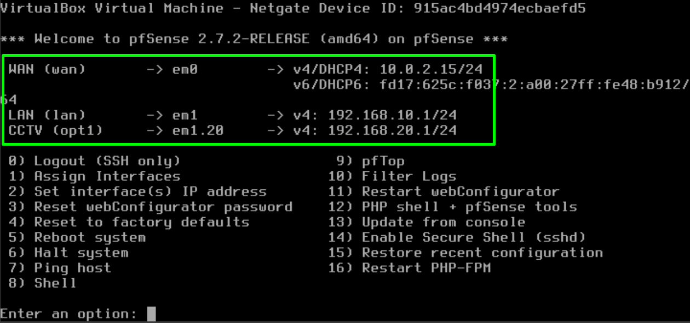
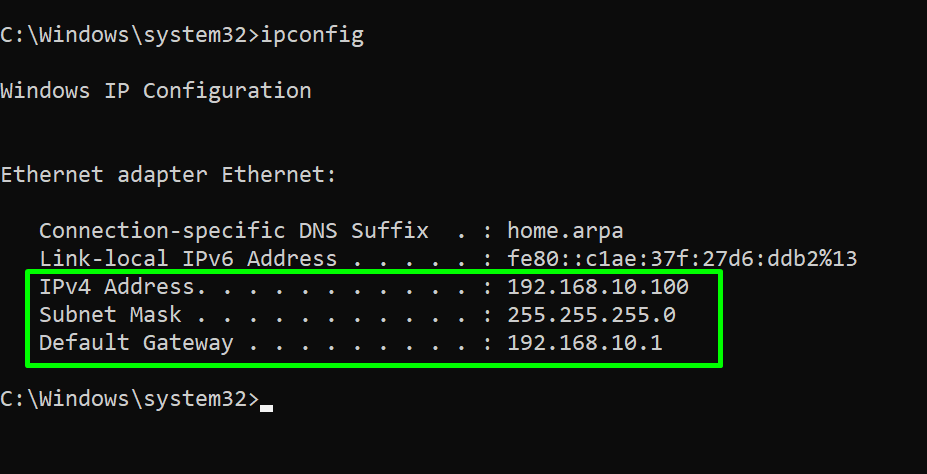
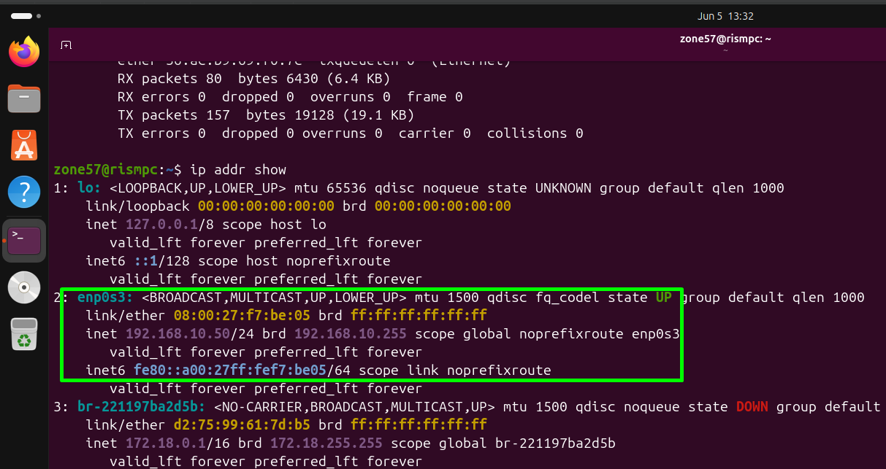
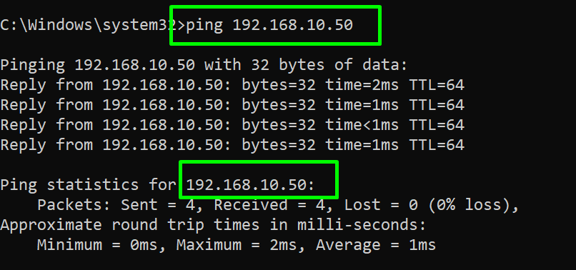
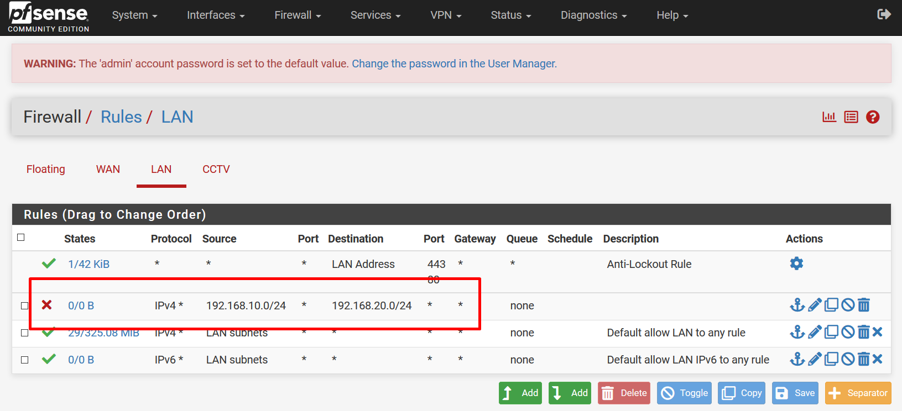
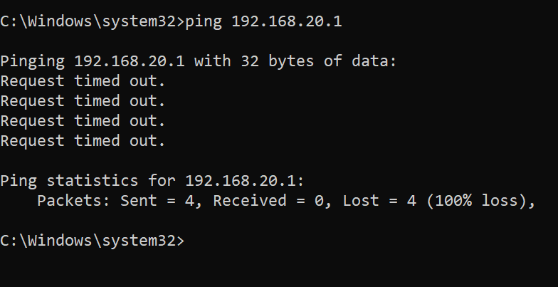
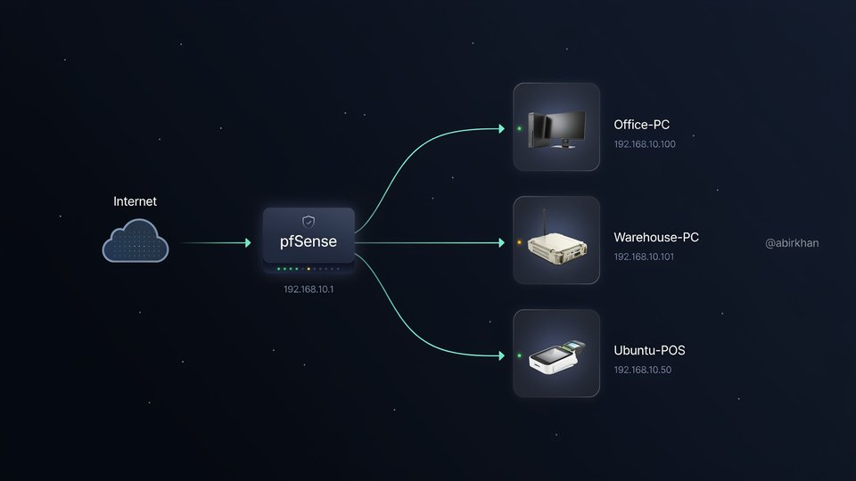

# 🖥️ Small Business IT Support Simulation

> **Complete homelab project demonstrating enterprise IT support skills**

**Author:** MD ABIR KHAN - IT Support Technician  
**Location:** Qatar (Visa: Transferable)  
**Portfolio:** [GitHub Repository Link]

---

## 📋 Project Overview

This project simulates a **realistic small business IT environment** including:

| Component | Description |
|-----------|-------------|
| 🔥 **pfSense Firewall** | VLAN isolation, DHCP, firewall rules |
| 💻 **3 Client Machines** | Office PC, Warehouse PC, Ubuntu POS system |
| 🎥 **CCTV VLAN** | Network segmentation with bidirectional blocking |
| 📊 **25 Help Desk Tickets** | Realistic issues with resolutions |
| 📚 **Complete Documentation** | New employee checklist & IT handover |

---

## 🏗️ Network Architecture

[INTERNET]
↓
[pfSense Firewall]
192.168.10.1/24
↓
[Internal Network]
↓
┌───────────────┬───────────────┬───────────────┐
↓               ↓               ↓               ↓
[Office-PC] [Warehouse-PC] [Ubuntu-POS] [CCTV VLAN]
.100        .101           .50          .20.0/24
4GB RAM     2GB RAM        2GB RAM (ISOLATED)

### 🔒 Security Feature

**CCTV VLAN is completely isolated from the office LAN:**

- Office network (192.168.10.0/24) → CCTV (192.168.20.0/24): **BLOCKED**
- CCTV (192.168.20.0/24) → Office network (192.168.10.0/24): **BLOCKED**

*Even if a camera is compromised, business data remains secure.*

---

## ✅ Completed Phases

### Phase 1-2: pfSense Firewall Deployment
- [x] VirtualBox environment setup
- [x] pfSense 2.7.2 installation and configuration
- [x] WAN (10.0.2.15) / LAN (192.168.10.1) interface assignment
- [x] DHCP server configured (192.168.10.100-200)

### Phase 3: Windows Client Deployment
- [x] Office-PC (Windows 10/11) installed
- [x] IP: 192.168.10.100 (DHCP)
- [x] Internet connectivity verified (ping 8.8.8.8)

### Phase 4: Multi-Client Environment
- [x] Warehouse-PC (cloned, 2GB RAM) - IP: 192.168.10.101
- [x] Ubuntu-POS (static IP) - IP: 192.168.10.50
- [x] Cross-client connectivity established

### Phase 5: CCTV VLAN & Isolation
- [x] VLAN 20 created on pfSense (192.168.20.0/24)
- [x] Firewall rules blocking LAN ↔ CCTV (bidirectional)
- [x] Isolation testing and validation

### Phase 6: Help Desk Simulation
- [x] 25 realistic tickets created
- [x] Each ticket includes: issue, resolution, time-to-fix
- [x] Priority-based ticket management (High/Medium/Low)

### Phase 7: Documentation & Deliverables
- [x] Network diagram (draw.io)
- [x] New employee IT checklist
- [x] Complete IT handover document
- [x] README.md

---

## 📸 Screenshots

### pfSense Console

*WAN: 10.0.2.15, LAN: 192.168.10.1*

### Office-PC Network Verification

*IP: 192.168.10.100, Gateway: 192.168.10.1*

### Ubuntu Static IP Configuration

*Static IP: 192.168.10.50/24*

### Cross-Client Connectivity

*Office-PC (192.168.10.100) pinging Ubuntu-POS (192.168.10.50)*

### Firewall Block Rule

*Block rule on LAN tab: 192.168.10.0/24 → 192.168.20.0/24*

### VLAN Isolation Test

*Office-PC cannot ping CCTV gateway (192.168.20.1) - BLOCKED ✅*

### Network Topology

*Complete network diagram with VLAN isolation*

---

## 🛠️ Technologies Used

| Category | Tools |
|----------|-------|
| **Virtualization** | Oracle VirtualBox 7.0 |
| **Firewall/Routing** | pfSense 2.7.2 CE |
| **Operating Systems** | Windows 10/11, Ubuntu 22.04 |
| **Documentation** | Markdown, draw.io, Excel |

---

## 🎯 Skills Demonstrated

| Skill | Evidence in This Project |
|-------|--------------------------|
| pfSense & VLAN configuration | Network diagram + firewall rules |
| Windows client administration | Office-PC + Warehouse-PC setup |
| Linux fundamentals | Ubuntu static IP, netplan configuration |
| Technical documentation | New employee checklist + IT handover (6+ pages) |
| Network troubleshooting | Cross-client ping tests, DHCP verification |
| Security best practices | Bidirectional VLAN isolation |
| Help desk operations | 25 tickets with detailed resolutions |

---

## 📂 Documentation Included

| Document | Purpose |
|----------|---------|
| [New Employee Checklist](documentation/new_employee_checklist.md) | Standardized IT onboarding process |
| [IT Handover Document](documentation/it_handover_document.md) | Complete system documentation for next admin |
| [Network Diagram](documentation/network_diagram.png) | Visual network topology |
| [Help Desk Tickets](tickets/Help_Desk_Tickets_25.csv) | 25 resolved tickets with resolutions |

---

## 📞 Contact

**MD ABIR KHAN**

| Method | Details |
|--------|---------|
| 📧 Email | abirup77@gmail.com |
| 🔗 LinkedIn | linkedin.com/in/abir2004 |
| 🎓 Certifications | IBM, Cisco, TCM Security, Hikvision |
| 📍 Location | Qatar (Visa: Transferable) |

---

## 📜 License

Portfolio demonstration project.

---

⭐ **Open to IT Support / Help Desk opportunities**

